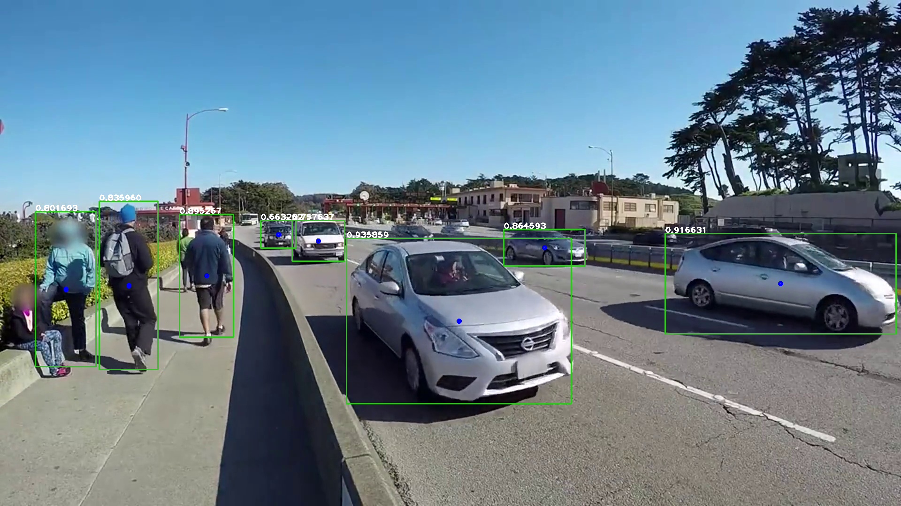

### Build yolov5s TensorRT inference app (COCO-pretrained)

	mkdir -p build && cd build
	mv ../yolov5s.engine.bz2 .
	bzip2 -d yolov5s.engine.bz2
	cmake ..
	make

	
### Run yolov5s TRT inference on test image directory

	./yolov5s_TRT_infer ../test_dir
	
	
### Sample output	

Sample annotated output image

Sample metadata output: 
(left, up, width, height, confidence, object_class)

	382 457 116 263 0.895267 0
	211 429 126 360 0.835960 0
	75 451 130 332 0.801693 0
	738 508 480 354 0.935859 2
	1417 498 493 215 0.916631 2
	1073 489 174 79 0.864593 2
	622 470 113 88 0.757637 2
	555 470 76 60 0.663252 2

	
	

